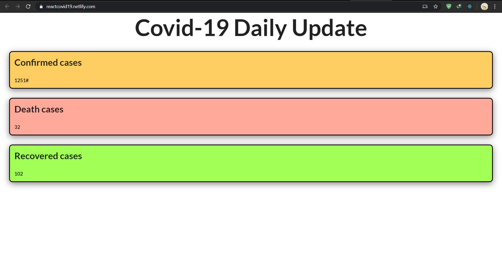

# Covid19
COVID-19 India data (from https://www.mohfw.gov.in/ for now) as-a-service
Here is the link for the api https://souravcovid19api.herokuapp.com/

# Routes
* /state : gives the data of all the state of India.
* /state/[statename] : gives the data of that state.
* /total : gives the total count.
